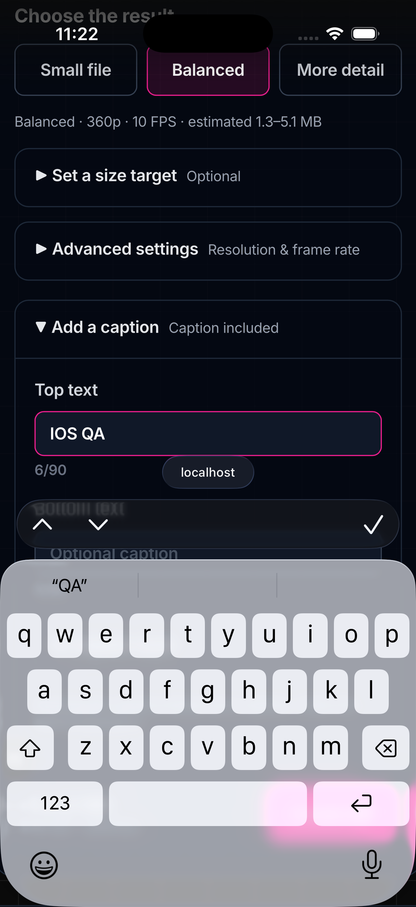
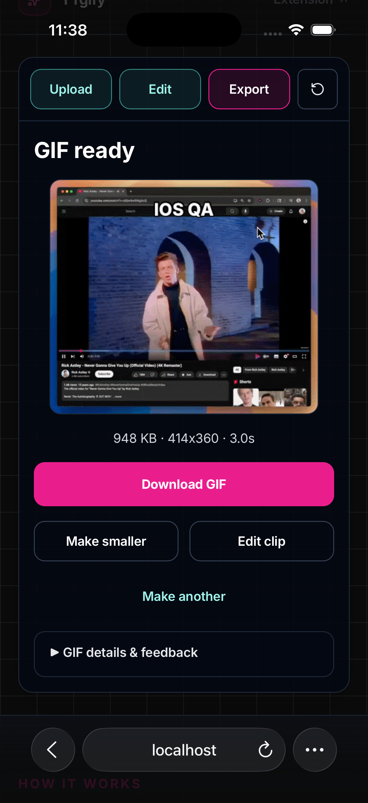
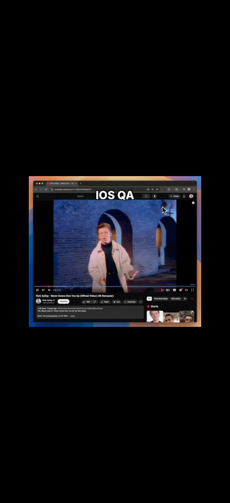

# iOS Simulator QA — September 7, 2026

## Completed follow-up

The previously blocked core journey now passes in Safari on a fresh **YTgify-QA, iPhone 17 Pro / iOS 26.5 Simulator** (`A40A5761-4197-48F6-8B58-0F131084D29C`). Tested the local production build at `http://localhost:3000/video-to-gif`, using the repository H.264/AAC fixture `tests/fixtures/ytgify-chrome-demo.mp4` (36.269 seconds).

- Imported the fixture into Photos and selected it through Safari's native Photo Library picker. The earlier round below verified Files selection.
- Entered a 2-second start and selected the 3-second preset: the preview showed 00:02.0–00:05.0.
- Opened the software keyboard, entered caption text, tapped a software-keyboard character, and confirmed the value persisted after dismissal. The active field remained above the keyboard and Create GIF returned after dismissal.
- Expanded Caption style and selected native color options. The final export used the white caption `IOS QA`.
- Created a GIF from a **fresh upload without pressing Play first**. Processing and success were brought into view automatically.
- Accepted Safari's Download confirmation, checked the completed download, and reopened the saved animated GIF.
- Chose Make smaller: trim and caption persisted, the previous download stayed available during processing, and the replacement exported, downloaded, and reopened successfully.

### Saved-file evidence

`ffprobe -count_frames` inspected the actual GIFs saved by Safari in the Simulator's Files storage:

| Result       |     Bytes | Frames | Dimensions | Duration      |
| ------------ | --------: | -----: | ---------- | ------------- |
| First export | 1,941,783 |     30 | 414 × 360  | 3.000 seconds |
| Make smaller |   970,908 |     15 | 414 × 360  | 3.000 seconds |

The second file is about 50% smaller, with the same caption and selected duration. Local originals and test logs are retained under `.ytgify-runtime/ios-qa/`.

### Fixes prompted by this round

1. **Fresh-source export stalled at frame extraction.** Keep the preview video attached during processing and start undecoded sources muted from the export gesture. Restore a paused preview afterward; cancellation and late playback resolution also pause the source.
2. **Export status appeared above the current scroll position.** Scroll the wizard into view on step changes, including processing and success.

These cover three realistic failure modes: undecoded/detached video (fresh iOS fixture export plus attached-source browser regression), lost or invalid smaller output (saved-file comparison and reopening), and inaccessible workflow state after a deep edit (software-keyboard UI checks plus viewport assertions). Decoder timeout, failure, cancellation, and mute restoration have focused unit coverage.

### Regression validation

- Fresh production-build Playwright suite: **69 passed**, no retries.
- Unit suite: **42 passed**, including five decoder-readiness tests.
- Full pre-push validation passed: lint, formatting, types, Knip, boundaries, build/routes, and four smoke tests.
- Independent focused review of the iOS lifecycle delta found no actionable issues.

### Screenshots

### Remaining scope and observations

This closes the previously blocked **Simulator core-journey** checks. Physical-iPhone performance, memory pressure, and camera-origin codec coverage remain separate checks. Native Simulator scroll/drag automation was unreliable, so precise touch dragging is covered by the Chromium mobile touch test rather than claimed as a Simulator pass.

Caption inputs trigger Safari's automatic zoom. With the keyboard showing, the first Caption style tap dismissed the keyboard and a second tap opened the disclosure. These are recorded usability follow-ups; they did not prevent editing or export.

Pointer automation intermittently returned `noWindowsAvailable`; toggling Simulator full-screen restored control. Production-build testing avoided dev-server hot-reload interference with active blob URLs.

## Earlier partial round (historical)

Partial round against the local mobile-ux-plan worktree at `http://localhost:3000/video-to-gif`, using iPhone 17 Pro / iOS 26.5 Simulator in portrait. No implementation changes were made during this round.

## Verified through Safari UI

- Upload heading, device-file explanation, and Choose video are visible above Safari's toolbar without scrolling.
- Choose video opens the native Photo Library / Choose File menu.
- The Photos picker opens, but contains no videos. `simctl addmedia` stalled, including an absolute-path retry bounded to 20 seconds. Photo-library selection is therefore unverified.
- Downloaded the repository's H.264/AAC MP4 fixture through a temporary loopback HTTP server as `ytgify-qa.mp4` (1.3 MB in Files).
- Choose File opens the native Files picker; selecting that fixture enters the editor with a 0–5s selection.
- Create GIF is visible above Safari's bottom toolbar in this initial editor view.

## Blocked checks

After file selection, the computer-use tool began returning `noWindowsAvailable` for all coordinate clicks, preceded by a ScreenCaptureKit invalid-parameter error. Screenshots and native accessibility menu actions continued to work. Re-selecting the app, raising the window, resetting the control session, dismissing menus, and changing window geometry did not restore pointer input.

A follow-up restored pointer control briefly by selecting the iPhone window through Simulator’s Window menu. Tapping Play successfully displayed and played the video inline. The initial black play surface is therefore not evidence of a playback failure. Subsequent scroll/drag input again failed with `noWindowsAvailable`, including after bringing all windows forward.

Software-keyboard occlusion, trim edits, nested captions/style, GIF export, GIF saving, and smaller-result recovery remain **unverified in iOS Simulator**. The earlier Playwright results still stand but do not substitute for these checks. Simulator QA is also distinct from physical-iPhone performance and memory testing.

The simulator remains on the loaded editor for continuation. The local app remains running. This round is not a completed iOS acceptance pass.
