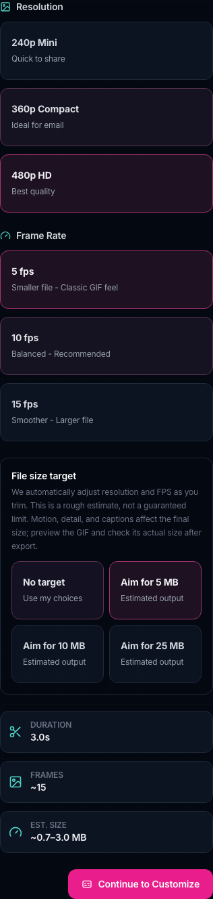
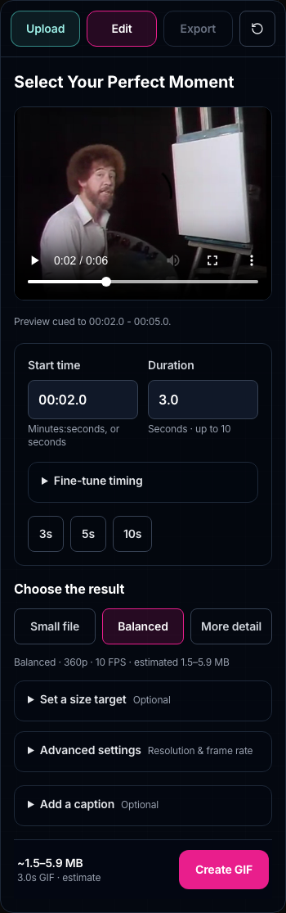
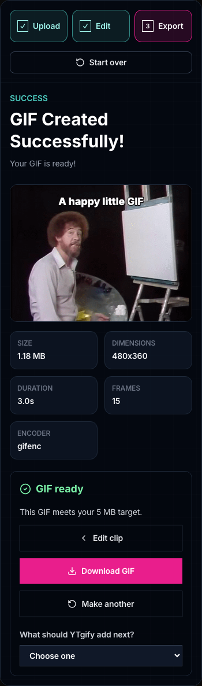
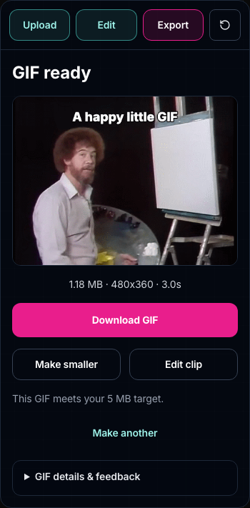

# Mobile journey comparison

These screenshots compare the intermediate local journey before progressive disclosure with the current local editor. They are not a production-versus-candidate comparison; production baseline evidence is described in the [comparison plan](2026-09-07-mobile-ux-comparison-plan.md).

| Before: expanded output controls                                  | After: simple editor with optional controls          |
| ----------------------------------------------------------------- | ---------------------------------------------------- |
|  |  |

| Before: result                                         | After: download and size adjustment first            |
| ------------------------------------------------------ | ---------------------------------------------------- |
|  |  |

The after images capture full steps at a mobile width. The sticky action bar is put in normal flow for the full-step screenshot only; actual viewport behavior remains sticky. See [acceptance evidence](2026-09-07-progressive-disclosure-validation.md) and [partial iOS Simulator QA](2026-09-07-ios-simulator-qa.md).
