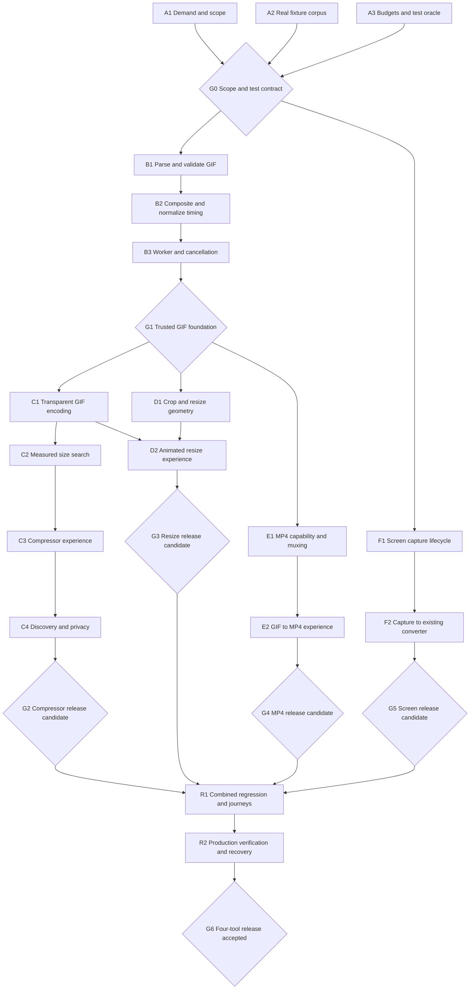

# GIF tools: development graph and acceptance contract

Status: original acceptance contract, September 8, 2026. Implementation and current gate evidence are tracked in [implementation-receipt.md](implementation-receipt.md); this planning document does not itself certify a release.

## Product decisions

Ship four independently useful anonymous, local tools: `/gif-compressor`, `/resize-gif` (including crop), `/gif-to-mp4`, and `/screen-to-gif`. Routes are proposed until research gate G0. Release the compressor first; do not hold it for the complete suite. Accounts, hosted files, share links, batch processing, URL imports, AI features, and mobile screen capture are outside this first version. Keep downloaded results and local processing as the default.

Compressor flow: choose GIF → set a target → compare original/result → download. Offer 1, 5, and 10 MB presets plus a custom target; define MB as 1,000,000 bytes in the UI and tests. These are generic size budgets, not claims about platform limits. Never label an estimate as success. Do not silently trim the animation or change loop semantics to meet a target. If the best acceptable output exceeds the target, report that outcome and let the user revise the target or explicitly choose a stronger reduction.

The first build tranche establishes a correct GIF reader and shared contracts. The next delivers compression. Resize/crop and MP4 consume those contracts after G1; screen recording consumes the existing video path. Merge shared changes sequentially. Separate tasks/worktrees are an execution option, not authorization to start implementation or create tasks now.

## Dependency graph

Every rectangle is a work package defined below. Diamonds are blocking acceptance gates. A node can start when all incoming prerequisites pass. A tranche closes only at its gate; completion counts and green builds do not override failed media evidence.

Recommended delivery order: A → B → C → D → E → F → R. The arrows also show where research and isolated prototypes could proceed sooner. Shared foundation changes after G1 must rerun its tests plus every dependent released tool's export tests.

## How a node earns acceptance

Use statuses planned, in progress, evidence ready, accepted, blocked. All nodes begin planned. Each task has one implementation owner and an evidence review step. Review means inspecting exported artifacts and assertions, not simply trusting a completion message; this does not require a separate agent. One coherent PR per node or tightly coupled node pair is the default.

Every receipt records: node ID, candidate commit SHA, dependency receipts, browser/OS/device and dependency versions, exact command and exit status, fixture SHA-256, chosen settings, original/export byte counts, duration/dimensions/loop results, exported file and independent decode report, UI screenshots where relevant, three realistic failure modes and direct evidence against them, and remaining limitations. Mocks must be labeled. No skipped critical case counts as passed. Retain evidence with the PR/CI artifacts, not only a temporary local path. Run against the actual merge candidate again when shared code changes.

## Tranche A — demand, corpus, and frozen test contract

| Node and ownership                            | Concrete work                                                                                                                                                                                         | Node acceptance and evidence                                                                                                                                                                                                                                                                                                                                               |
| --------------------------------------------- | ----------------------------------------------------------------------------------------------------------------------------------------------------------------------------------------------------- | -------------------------------------------------------------------------------------------------------------------------------------------------------------------------------------------------------------------------------------------------------------------------------------------------------------------------------------------------------------------------- |
| A1 — research documents                       | Expand each tool's keyword clusters and inspect 3 representative SERPs per tool; record top 5 organic tools on each. Preserve geography, language, date, source, ad features, and screenshots/export. | Four acquisition briefs separate tool intent from tutorials, reverse conversions, and branded ScreenToGif queries. Do not add overlapping Keyword Planner ranges. Each names one route, one user job, a differentiated MVP, competing workflows, and measured demand versus assumptions. Missing access is explicit; no invented volume or obtainable-traffic promise.     |
| A2 — fixture files and manifest               | Inventory existing GIFs; create original test animations and acquire additional reusable real-world files only with recorded provenance.                                                              | Every fixture has hash, bytes, dimensions, frames, raw delays, loop field, disposal modes, palette/transparency features, provenance, expected outcome, and license/redistribution status. The complete matrix below is present as actual files. Tiny generated cases have independently specified expected pixels; at least 6 natural-content GIFs exercise real exports. |
| A3 — test helpers and benchmark specification | Select independent decoding/probing tools; define timing normalization, comparison method, supported browser tiers, and resource limits.                                                              | A deliberately corrupted frame, wrong delay, wrong loop, and oversized output each fail the harness. Pin versions and reference devices. Freeze limits before optimizer tuning. Compare at least one fixture with two decoder implementations and actual browser playback; resolve disagreements before acceptance.                                                        |

**G0:** A1–A3 receipts accepted. All four scopes and support policies written; every corpus category has a file; numerical thresholds below either adopted or changed with a recorded rationale before implementation. Research can change order or defer a candidate, but cannot erase its unresolved evidence requirements.

## Tranche B — trusted animated-GIF foundation

Proposed boundary: `lib/media/gif/` for parser adapters, metadata, compositor, and timing; `lib/media/jobs/` for worker orchestration. The name is a proposal, not permission for a broad converter refactor. Keep browser adapters separate from pure calculations and follow repository file-size limits.

| Node and ownership             | Concrete work                                                                                                                                                                                              | Node acceptance and evidence                                                                                                                                                                                                                                                                                                                                                      |
| ------------------------------ | ---------------------------------------------------------------------------------------------------------------------------------------------------------------------------------------------------------- | --------------------------------------------------------------------------------------------------------------------------------------------------------------------------------------------------------------------------------------------------------------------------------------------------------------------------------------------------------------------------------- |
| B1 — GIF parser and validation | Read signature, logical canvas, frame rectangles, palettes, raw delays, transparency, and loop metadata; reject unsafe structures before allocating frames.                                                | Valid GIF87a/GIF89a files parse. Truncated LZW/subblocks, false extensions/MIME, out-of-bounds patches, excessive dimensions/frame counts, and expansion bombs produce typed recoverable errors. Tests prove preflight occurs before full-frame allocation. Record unsupported plain-text/user-input extensions and reject clearly rather than silently changing their semantics. |
| B2 — compositor and timeline   | Produce complete RGBA frames from patches. Implement disposal 0/1/2/3, local palettes, interlace, transparent index, and restore-previous state. Keep absent, finite, and infinite loop metadata distinct. | Every diagnostic frame equals the independently specified canvas byte-for-byte. Compare natural-content frames with independent decoder output. Variable delays and loop boundaries match the frozen timing policy; no ghosting, missing patches, or black transparent background. Parser library normalization cannot silently replace raw metadata.                             |
| B3 — job worker and lifecycle  | Move decoding/composition off the main thread; bound live allocations; define cancellation, replacement, progress, and cleanup contracts.                                                                  | Cancel during parse, decode, and handoff; choose another file mid-job; unmount and retry. Only the latest job may publish a result. No late success/download after cancellation. Cancellation and memory gates below pass, with original input still usable after an error.                                                                                                       |

**G1:** all corpus cases decoded or rejected exactly as specified; independent comparison passes; timing/loop tests pass; worker stress receipt passes. Existing video-to-GIF fixtures still export correctly. No tool consumes this foundation with unresolved disposal or transparency defects.

## Tranche C — compressor, the first shippable tool

| Node and ownership                          | Concrete work                                                                                                                                                                                                                           | Node acceptance and evidence                                                                                                                                                                                                                                                                                                                                                                                                                    |
| ------------------------------------------- | --------------------------------------------------------------------------------------------------------------------------------------------------------------------------------------------------------------------------------------- | ----------------------------------------------------------------------------------------------------------------------------------------------------------------------------------------------------------------------------------------------------------------------------------------------------------------------------------------------------------------------------------------------------------------------------------------------- |
| C1 — GIF encoder adapter                    | Add explicit transparent-index and loop handling; use a correctness-first full-frame path before optimizing patches. Preserve current converter behavior behind its existing adapter.                                                   | Reopen every downloaded output independently. Exact alpha masks on no-resize diagnostic cases; exact frames for the ≤256-color lossless cases; correct loop semantics and normalized total duration. Palette reduction must not overwrite the transparency slot. Existing caption, motion, and 5/10/15 FPS video exports pass in the browser matrix.                                                                                            |
| C2 — optimizer and measured byte accounting | Search a bounded, ordered set of palettes, dimensions, and frame sampling options. Start by preserving dimensions/timing. Enable dimension or motion reduction explicitly and show effective settings. Keep the original as a baseline. | Every “target met” result has actual downloaded bytes ≤ target. Test exact-limit, one-byte-over, already-small, incompressible, and impossible-target cases. Never call a larger result an improvement. Aggregate dropped-frame delays rather than speeding up playback. At most 12 candidates and the time budget below; return best acceptable result or an honest failure. Frozen quality criteria must pass before a candidate is eligible. |
| C3 — compressor route/UI                    | Upload, presets/custom target, progress/cancel, original/result comparison, measured savings, retry, download, and explicit stronger-reduction control.                                                                                 | Real-file upload → downloaded export works on every supported browser. Invalid input and worker errors recover without reload. Preview uses the exact export blob. Verify target edits invalidate stale results. Keyboard flow, focus, live errors, 390 px and 320 px layouts, and native mobile save/open pass. Comparison can pause motion. No account prompt.                                                                                |
| C4 — discovery and analytics privacy        | Add unique metadata, useful visible instructions/FAQ, canonical route, sitemap and internal links; add minimal events.                                                                                                                  | Built route exists; canonical/schema match visible content; links work. Network inspection across success/cancel/error proves no media bytes, file names, captions, screenshots, file URLs, or hashes leave the device. Disable replay/autocapture on sensitive tool surfaces unless a test proves exclusion. Record only allowlisted tool/outcome/coarse buckets, no exact target values or identifiers derived from the media.                |

**G2:** C1–C4 plus the common release gate below pass. Export all 6+ natural GIFs, including three size targets per file (80%, 50%, and an intentionally unrealistic 5% of original bytes, rounded down). Failure to meet a target is valid only when reported accurately; the dedicated compressible fixture must achieve at least 20% reduction without failing quality. This prevents a tool that always says “cannot compress” from passing. Compressor may ship independently after this gate and its own production verification.

## Tranche D — animated crop and resize

| Node and ownership       | Concrete work                                                                                                           | Node acceptance and evidence                                                                                                                                                                                                                                                                                                                                    |
| ------------------------ | ----------------------------------------------------------------------------------------------------------------------- | --------------------------------------------------------------------------------------------------------------------------------------------------------------------------------------------------------------------------------------------------------------------------------------------------------------------------------------------------------------- |
| D1 — geometry transforms | Pixel dimensions, aspect lock, crop coordinates, fit/pad, and bounds validation.                                        | Coordinate-grid fixtures prove the exact selected region, including CSS-scaled preview, nonzero crop origin, 1-pixel borders, odd dimensions, and portrait inputs. Export dimensions exactly match requested values; expected resampling compared with the frozen reference transform. Zero/negative/huge dimensions reject before allocation.                  |
| D2 — resize UI/export    | Accessible numeric crop alternative, touch/pointer crop, preview and actual GIF download using accepted B/C1 contracts. | Each natural GIF exports at half-size and a noncentral crop. Alpha, timeline, loop behavior, and transformed diagnostic landmarks pass; preview matches file. Keyboard/touch workflows, resizing while processing, cancellation, and mobile saving pass. Exact edge alpha tests use nearest-neighbor mode; other filters use a defined alpha-resampling oracle. |

**G3:** D1/D2 and common release gate pass. No stretching when aspect lock is enabled; no crop-preview/output mismatch; no timing regression. Complete route discovery and privacy checks equivalent to C4.

## Tranche E — GIF to genuine MP4

| Node and ownership                    | Concrete work                                                                                                                                                            | Node acceptance and evidence                                                                                                                                                                                                                                                                                                                                                                                                                         |
| ------------------------------------- | ------------------------------------------------------------------------------------------------------------------------------------------------------------------------ | ---------------------------------------------------------------------------------------------------------------------------------------------------------------------------------------------------------------------------------------------------------------------------------------------------------------------------------------------------------------------------------------------------------------------------------------------------- |
| E1 — encoding/muxing capability spike | Test supported encoder configurations and a real MP4 muxer. Choose and document the browser matrix from actual exports; do not assume API presence proves codec support. | Independent probe identifies MP4 container and the chosen codec; desktop Chrome/Firefox/Safari playback checks on exported samples. Correct dimensions and decoded motion. Unsupported environments get an actionable explanation before work starts. Do not ship WebM renamed as MP4. Test dimensions requiring padding and state the padding policy.                                                                                               |
| E2 — conversion UI and timeline       | Background color for transparency, explicit repeat count (default one cycle), bounded duration, preview, download. No source audio claim.                                | Export all natural and transparency/timing diagnostics at one and three cycles. Probe duration differs from normalized GIF timeline by at most one output-frame interval plus 10 ms. Diagnostic frame order is monotonic with correct boundary colors; selected background replaces transparency. No unintended audio stream. Codec failure, flush failure, cancellation, and mobile playback/save recover or match documented unsupported behavior. |

**G4:** E1/E2 plus common gate pass for the declared support matrix. A mocked encoder is insufficient; inspect genuine downloaded MP4 files. Complete C4-equivalent discovery/privacy checks.

## Tranche F — screen to GIF

| Node and ownership                          | Concrete work                                                                                                                                                         | Node acceptance and evidence                                                                                                                                                                                                                                                                                                                                                                                                                                                         |
| ------------------------------------------- | --------------------------------------------------------------------------------------------------------------------------------------------------------------------- | ------------------------------------------------------------------------------------------------------------------------------------------------------------------------------------------------------------------------------------------------------------------------------------------------------------------------------------------------------------------------------------------------------------------------------------------------------------------------------------ |
| F1 — capture/recording lifecycle            | Explicit user Start, native picker, recording timer, Stop, stream-ended handling, and cleanup. Start with a 30-second recording cap and existing ≤10-second GIF trim. | Test picker cancellation, denial, browser Stop Sharing, route exit, and recording cap. Every video/audio track is ended within 1 second of stop/cancel; no automatic restart or permission request on load. Unsupported mobile/browser path is visible before capture. Automated stream mocks cover branches but cannot close this node alone.                                                                                                                                       |
| F2 — converter integration and real capture | Capture an original local animation with moving frame IDs and timed color changes; pass recorded video into existing trim/export flow.                                | A real native-picker capture on every declared supported desktop browser produces a downloadable GIF with progressing visible frame IDs. Compare against the recorded source's timestamps, allowing at most one capture interval plus one GIF output interval. Pause-free sample has no unexplained blank/frozen interval longer than 500 ms. Preview/trim/export/cancel/retry and current local-file video conversion all pass. Save the recorded source and final GIF as evidence. |

**G5:** F1/F2 plus common gate pass. Native permission/capture evidence is required; unsupported platforms are explicitly tested as unsupported. Record a controlled test surface only. Complete C4-equivalent discovery/privacy checks.

## Real-file corpus and independent oracle

Existing files inspected today (using the repository's gifuct-js dependency):

| ID  | Existing file                     |  Bytes | Dimensions | Frames | Decoder-reported cycle |
| --- | --------------------------------- | -----: | ---------- | -----: | ---------------------: |
| N1  | `public/examples/free-gratis.gif` | 287625 | 256 × 144  |     30 |                3000 ms |
| N2  | `public/examples/boom-baby.gif`   | 308310 | 256 × 144  |     25 |                2500 ms |
| N3  | `public/examples/witness-me.gif`  | 446528 | 256 × 144  |     30 |                3000 ms |

All three contain transparency flags and disposal mode 1; a transparency flag alone does not prove the displayed canvas contains transparent pixels. Raw delay and loop metadata and independent compositing remain to be verified in A2. Existing site availability is not a license receipt; do not newly redistribute these samples without checking provenance. Use original replacements if needed for public CI artifacts.

Add at least three natural-content original GIFs: N4 a text-heavy software tutorial, N5 a fast-motion/detail clip, N6 a transparent illustration/sticker. Include low/high entropy, portrait, and already-optimized variants. Maintain natural examples as a fixed holdout set; do not tune only on them.

Create the following as **actual binary GIFs**, with deterministic source generators and independently specified expected frames:

| IDs     | Required coverage                                                                                 | Expected check                                                                     |
| ------- | ------------------------------------------------------------------------------------------------- | ---------------------------------------------------------------------------------- |
| X1–X4   | Partial patches with disposal 0, 1, 2, 3; overlapping movement                                    | Full RGBA canvases and restored background/previous state match goldens.           |
| X5      | Local palettes, transparent-index reuse, palette changes                                          | No color bleed, transparent pixels stay transparent.                               |
| X6      | Variable delays, 0/10 ms edge cases, missing delay                                                | Raw values preserved in metadata; output follows explicit normalization policy.    |
| X7–X9   | No loop extension, finite repeat, infinite repeat                                                 | Semantics retained through compression/resize; MP4 uses selected finite cycles.    |
| X10     | Interlaced GIF and nonzero patch origins                                                          | Expected rows and coordinates match.                                               |
| X11     | Single frame, 1 × 1, odd dimensions, fully transparent frame                                      | Valid result or explicitly documented product restriction; no crash or black fill. |
| X12     | Numbered frames, crop grid, small text, crisp edges                                               | Motion/geometry/caption landmarks survive the relevant transform.                  |
| X13     | Highly compressible redundant encoding and already-optimized counterpart                          | Useful reduction on former; honest no-improvement on latter.                       |
| X14–X16 | Truncation/malformed LZW, deceptive extension, huge canvas/frame count with tiny compressed input | Bounded typed rejection before runaway allocation.                                 |

The production parser cannot be its own only oracle. Use an independently implemented decoder such as Pillow or ImageMagick with pinned versions to composite downloaded GIFs, plus raw block inspection for delays/loops. Use independently specified goldens to arbitrate decoder differences. For MP4 use ffprobe plus actual browser playback. Screenshots alone cannot establish animation correctness; attach the exported binaries and decoded timelines/contact sheets.

## Numerical contract to freeze at G0

These are proposed engineering targets, not measured current performance. A3 must benchmark them on named hardware and record any adjustment before C2 tuning; a later failing result is not permission to weaken them silently.

- Input guardrails: initially 25 MB compressed bytes, 60 seconds normalized cycle, 600 frames, and 4096 pixels per side, subject to stricter decoded-memory checks. These are separate checks, not a promise that every file at every maximum fits.
- Memory: 80 MiB maximum app-owned live pixel buffers as the initial baseline, counting compositor snapshots, palette/dither scratch, worker transfers/copies, and candidates. Existing converter's estimate counts frame RGBA only and cannot establish this limit for GIF decoding. Benchmark browser-process memory separately; after 10 upload/export/reset cycles there must be no monotonic retained growth beyond a recorded 20 MiB tolerance after settling. Record unsupported memory instrumentation; do not claim precise process memory from buffer accounting.
- Work limit: at most 12 optimizer attempts and 60 seconds total on the named reference desktop for the bounded benchmark corpus. On mobile use the same cap with a recoverable timeout; tighten supported input limits if necessary. Cancel-to-ready ≤1 second. A 100 ms main-thread heartbeat has no gap >250 ms during worker processing on that device.
- Timing: proposed playback normalization is missing/0/10 ms →100 ms, all ≥20 ms unchanged. Preserve raw values separately and disclose normalization when applied. This is a product compatibility policy, not a GIF-spec claim. For no temporal resampling, normalized cycle duration is exact in centiseconds. For sampling, sum removed intervals into retained frames so total remains exact. Test finite loops in an independent playback harness.
- Geometry/alpha: exact dimensions and diagnostic crop coordinates. Exact binary alpha mask for no-resize GIF round trips. Tests of resize compare against a separately generated alpha-resampling reference.
- Quality: exact pixels on deliberately lossless diagnostic fixtures. For natural-content compression, proposed default eligibility is duration-weighted mean SSIM ≥0.95 and no sampled frame <0.90 against the normalized reference at the same output dimensions; pin the implementation and compare transparent content against both light/dark mattes. A3 must establish a time-aligned sampling rule including every diagnostic transition. Resizing down cannot earn a quality pass merely by comparing equally blurred images: record dimension/frame-rate reductions separately and require explicit user consent. Manual side-by-side playback must also confirm readable test text, no ghost trails, no lost subject, and no visible unexpected pauses. SSIM is supporting evidence, not a complete quality definition.
- Bytes: only actual downloaded byte count determines target success. Savings percentage uses original bytes as denominator; show zero/no improvement rather than misleading negative savings. Match filename extension, MIME, and actual container signature.

## Common tool release gate

For G2–G5, all relevant node receipts must pass on a production-shaped build. Run the repository-required lint/format/type/dependency/CI-boundary/unit/build/public-route gates. Extend suite selection for each new route and shared media module; unknown/shared changes must still run all affected suites. Do not copy an existing hook configuration that accidentally lints nested worktrees.

Run genuine exports in Chromium, Firefox, and WebKit wherever support is claimed, plus real Safari on macOS/iOS and Chrome on Android for claimed mobile conversion/save behavior. Playwright WebKit is not evidence of native iOS download behavior. Record exact devices/versions; unavailable required hardware keeps that support tier unaccepted, or the stated launch support is narrowed with an explicit decision.

All supported tiers must pass: successful file-to-download journey; expected timing/loops/pixels/bytes; malformed input; resource rejection; cancellation in every expensive stage; retry/replacement; ten-job cleanup; keyboard/focus and screen-reader labels; 320/390/desktop layouts; privacy network assertions; canonical/discovery checks. Re-run current converter motion/caption/timing fixture exports and homepage navigation. A real-browser console/network error must be triaged rather than ignored because the export happened to finish.

## Final tranche and release acceptance

| Node                         | Acceptance and evidence                                                                                                                                                                                                                                                                                                                                                                                                                                      |
| ---------------------------- | ------------------------------------------------------------------------------------------------------------------------------------------------------------------------------------------------------------------------------------------------------------------------------------------------------------------------------------------------------------------------------------------------------------------------------------------------------------ |
| R1 — combined candidate      | All G2–G5 accepted on compatible shared contracts. Test compressor → resize → MP4 with N4 and the transparency/timing diagnostic; test real screen capture → GIF → compressor with the controlled recording. Reinspect intermediate and final files independently. Re-run all existing and new site/media suites against one candidate SHA. No stale results or shared-library regressions across tools.                                                     |
| R2 — production and recovery | After separately authorized deployment, verify each canonical production URL, correct artifact/version, navigation, and one original real-file export per tool (native capture for screen). Observe allowlisted analytics without leaking media. Document and rehearse rollback to the prior static artifact in a nonproduction environment; confirm which tool links disappear on rollback. Retain release evidence and mark unavailable checks explicitly. |

**G6: final four-tool version accepted** only when R1/R2 pass, the support matrix is honest, all blocking defects are resolved, and every evidence receipt refers to the released candidate. A release candidate is not a deployed release. Compression ratios and search rankings are not guaranteed outcomes.

After release, compare tool impressions/clicks and privacy-safe upload→export→download outcomes against the dated baseline at 14 and 28 days. This is a measurement proposal, not a scheduled automation. Segment new tool pages and exclude internal QA. Small samples require restraint; investigate errors and unmet targets before adding more features. Revisit optional accounts only if repeated workflows or hosted sharing show a concrete user need.

## Grounding and limitations

- `lib/studio/encoders/gifenc-encoder.ts` currently uses RGB palettes, disposal 2, and infinite repeat; do not assume transparent/finite-loop input is already supported.
- `tests/helpers/visual-content.ts` uses gifuct-js to inspect genuine downloads and explicitly asserts full opaque frames. Reuse the export-evidence pattern, not that restriction for arbitrary GIF input.
- `lib/studio/size-target.ts` estimates size; the compressor needs measured candidate outputs. `lib/studio/export-budget.ts` supplies an 80 MiB frame estimate, not total-process memory accounting.
- [GIF89a specification](https://www.w3.org/Graphics/GIF/spec-gif89a.txt): authoritative basis for canvas/patches, graphic control/disposal, palettes, transparency, and centisecond delays. Loop extensions require separate explicit handling.
- [VideoEncoder configuration support](https://developer.mozilla.org/en-US/docs/Web/API/VideoEncoder/isConfigSupported_static): check the proposed configuration, then prove an actual playable MP4 rather than assuming encoder availability is enough.
- [Screen capture API](https://developer.mozilla.org/en-US/docs/Web/API/MediaDevices/getDisplayMedia): user interaction and permission are required; native capture is a distinct acceptance step.

Planning acceptance: checked existing source boundaries, inspected three real GIF files, and connected every implementation node to a gate and evidence contract. Missing fixtures, benchmarks, demand refinement, and actual new-tool exports are explicitly future work. The plan does not mark any implementation gate passed.
