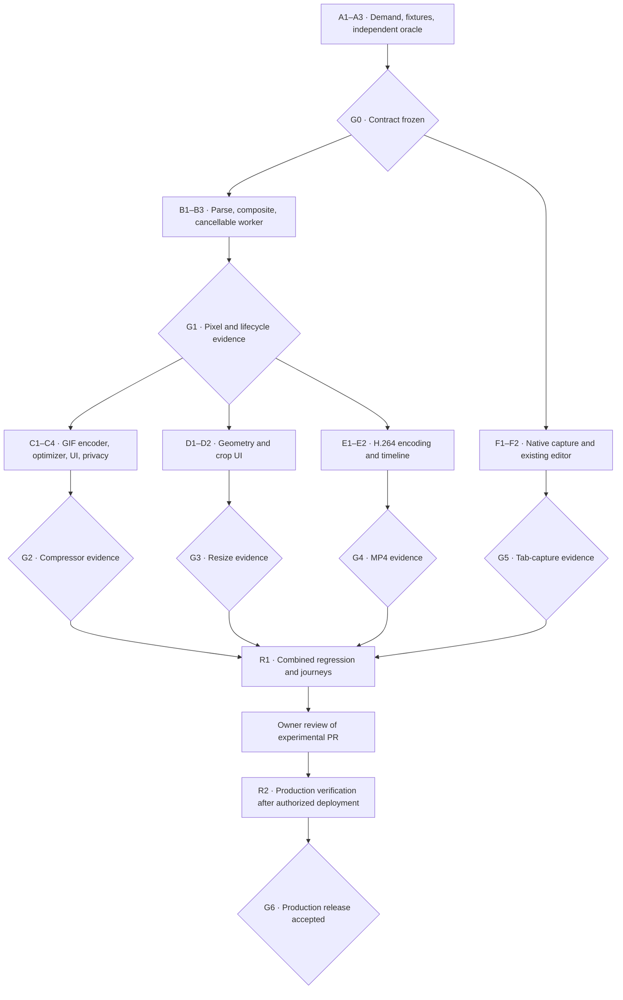

# Experimental GIF tools: implementation and acceptance receipt

The four tools are implemented on `codex/gif-tools-foundation`, targeting `codex/gif-tools-experimental` in [PR #39](https://github.com/ytgify/ytgify.com/pull/39). Production and `main` have not changed. The governing requirements remain in [development-plan.md](development-plan.md); the original plan is not itself an acceptance receipt.

## Review map



G0–G5 have implementation evidence for the experimental desktop scope below. Final acceptance remains subject to the candidate's CI result and review of the linked evidence. **R2 production verification and G6 remain unaccepted.** Rollback rehearsal has passed locally; that does not substitute for a deployed smoke test.

## Node receipts

| Node | Implementation                                                                                   | Direct grounding evidence                                                                                                                                                                                                                                                                                                                     |
| ---- | ------------------------------------------------------------------------------------------------ | --------------------------------------------------------------------------------------------------------------------------------------------------------------------------------------------------------------------------------------------------------------------------------------------------------------------------------------------- |
| A1   | Additional Keyword Planner and SERP research for resize, GIF→MP4, and screen capture             | [Keyword evidence](remaining-keyword-evidence.json), [SERP evidence](remaining-serp-evidence.json), [frozen contract](g0-contract.md). US/English/Google ranges, not exact demand forecasts; reverse-conversion and branded queries are distinguished.                                                                                        |
| A2   | Original diagnostic GIFs plus six attributed natural clips, including two holdouts               | 30 GIF files: 24 positive and 6 negative. [Corpus README](../../../tests/fixtures/gif/README.md), manifests, authored PNG goldens, hashes and licensing.                                                                                                                                                                                      |
| A3   | Pillow and gifuct-js oracle, independent FFmpeg probing, deliberate corruption controls          | [Fixture receipt](fixture-harness-receipt.json). Actual palette/delay/loop mutations and a one-byte-over limit fail the harness.                                                                                                                                                                                                              |
| B1   | Bounded GIF87a/89a parser with raw delay, loop, palette and rectangle metadata                   | Production unit tests compare the positive corpus with the frozen independent oracle and reject all six negative inputs before unsafe pixel allocation.                                                                                                                                                                                       |
| B2   | LZW decoding, interlace, full-canvas composition and disposal 0–3                                | Frame-by-frame hashes against the independent oracle; transparent/opaque transitions and partial frames round-trip through actual exported GIF files.                                                                                                                                                                                         |
| B3   | Worker generations, cancellation, transfer, replacement, timeout and cleanup                     | [Lifecycle receipt](evidence/lifecycle-receipt.json): 36 ms cancellation, 101.4 ms processing heartbeat maximum, 10 jobs, zero surviving workers, two retained preview URLs. Both JS heap and isolated test-browser RSS are measured. Replacement and delayed-handoff tests cover late completion.                                            |
| C1   | GIF encoder with shared transparency policy and preserved looping                                | 24 actual round-trip files independently agree through gifuct-js and Pillow. Transparent padding receives explicit alpha assertions.                                                                                                                                                                                                          |
| C2   | Measured targets, at most 12 candidates, optional resize and frame reduction                     | [Natural export matrix](evidence/natural-export-matrix.json): 18 downloads across six natural GIFs and three targets, independent quality checks, actual byte counts. Frame reduction sums dropped-frame delays and compares against the original timeline. Impossible targets remain honest.                                                 |
| C3   | Upload, original/output previews, pause, presets/custom target, cancellation, focus and download | Browser exports, malformed-file recovery, replacement, narrow layouts, measured target outcomes and cross-tool reuse. MB means 1,000,000 bytes.                                                                                                                                                                                               |
| C4   | Canonical routes, schema, instructions, sitemap/footer links and minimal analytics               | Built routes verified; [enabled PostHog events](evidence/actual-posthog-events.json) inspected across success, cancel, download and error. Every private path is unit-tested. Replay/autocapture are disabled on new-tool entry; the filter also drops them. Google Analytics is omitted on new-tool pages.                                   |
| D1   | Numeric crop, nearest-neighbor resize, aspect lock and transparent contain mode                  | Downloaded crop pixels checked with Pillow against a noncentral source rectangle; alpha bars, bounds, timing and memory rejection checked separately.                                                                                                                                                                                         |
| D2   | Draggable crop with equivalent labeled numeric controls                                          | Browser crop→download→reupload flow and responsive layouts. Source pixels are mapped to the displayed crop rectangle without modifying the original.                                                                                                                                                                                          |
| E1   | Capability-gated H.264 encoding and genuine MP4 muxing                                           | FFprobe verifies codec/container, dimensions and absence of audio; decoded RGB and frame timestamps are inspected independently. Bundled Chromium's unavailable encoder is handled explicitly.                                                                                                                                                |
| E2   | Background, bounded repeat count, playback and download                                          | Six natural plus three diagnostic GIFs exported at one and three cycles: 18 real MP4s in the matrix. Tiny inputs and odd dimensions are padded as disclosed.                                                                                                                                                                                  |
| F1   | Explicit native capture, elapsed timer, 30-second cap and track cleanup                          | Real Chrome tab capture with a controlled animated surface, real MediaRecorder, cap, source-tab closure, route exit and all tracks ended. Denial is tested separately; no source is requested on page load.                                                                                                                                   |
| F2   | Finalize duration metadata and reuse the existing trim/caption/GIF editor                        | [Actual native recording→GIF](evidence/native-tab-capture.gif), independent moving-frame inspection, and GIF→compressor handoff. A decoded-frame warmup removes the initial uninitialized black frame.                                                                                                                                        |
| R1   | Existing site/converter regression plus new-tool journeys                                        | [Browser regression receipt](evidence/browser-regression.json): 136 passes; the dedicated enabled-analytics test passed separately. Natural, transparency and timing journeys exercise compressor→resize→MP4. [Targeted follow-ups](evidence/targeted-browser-checks.json) cover subsequent lifecycle/privacy refinements and native capture. |
| R2   | Nonproduction rollback rehearsal; deployment held for review                                     | [Rollback receipt](evidence/rollback-rehearsal.json): candidate routes 200; prior artifact restores existing converter while new routes return 404; candidate restored. Production smoke and G6 are still pending.                                                                                                                            |

## Support and interpretation

- Experimental support target: desktop Chrome on macOS, including native **tab** capture. Firefox and Playwright WebKit export checks also pass on this machine; those engine runs are not native Safari/iOS evidence.
- Mobile layouts are checked in emulation. Native iOS/Android save behavior, lower-memory hardware, manual OS permission dialogs, window capture and entire-screen capture remain unaccepted support tiers. Their availability is not inferred from a desktop pass.
- The native test uses Chromium's documented [tab-only source-selection switch](https://chromium.googlesource.com/chromium/src/+/refs/heads/main/chrome/common/chrome_switches.h), selecting only the controlled test tab. It uses the real capture API and encoder, not a fake stream. Separate canvas-stream tests supplement this evidence.
- Compression protects quality before size. At original dimensions, five of these already-optimized natural clips retained their original bytes; one improved by approximately 10%. Allowing smaller dimensions is an explicit choice, and no ranking or compression-ratio guarantee is made.
- Media is not persisted or uploaded. Accounts, cloud saves and public share links remain outside this implementation. The four tools deliver their initial value without a login requirement.

## Corrections discovered by the gates

1. Grayscale SSIM missed color loss on two clips (independent means about 0.93 and 0.92). Selection now evaluates each RGB channel on black and white mattes, using stricter internal thresholds of 0.98 mean / 0.95 minimum. The frozen external minimums remain 0.95 / 0.90; all 18 natural cases pass them.
2. H.264 rejected tiny diagnostics. MP4 dimensions are now padded to even values of at least 16×16, and the UI reports this policy. Pixels are not silently stretched.
3. MediaRecorder duration metadata was unsuitable for the editor. Remuxing writes a seekable timeline without re-encoding; stream tracks end before preparation. Waiting for decoded capture pixels also prevents an initial black frame.
4. Removing PostHog's project token prevents ingestion. The allowlist retains that required token and the SDK's anonymous `distinct_id`, alongside tool/outcome and geolocation disablement. Neither identifier comes from the media. The dedicated test enables the real SDK while intercepting all analytics locally and neutralizing its automation-user-agent filter in the test only.
5. Reserving optimizer memory during inspection rejected some ordinary GIFs produced by the existing editor. Decoder admission now counts its own live allocations; transform and optimizer allocations are checked separately before creation. The 80 MiB ceiling is unchanged. Already-small GIFs can retain their original bytes without allocating optimizer candidates.
6. Linux CI exceeded the five-second unit-test default for the 24-file round-trip corpus and two optimizer searches. Those two workload tests now have explicit 30-second test budgets; product deadlines and all pixel, timing, quality and resource assertions are unchanged.
7. Knip's former production patterns omitted actual source traversal. Explicit production entries now include the worker, exposing and fixing unused exports. Temporary rollback/build artifacts are excluded from source checks; no source file-size ceiling was increased.

## Reproduction

Install npm dependencies, Playwright browsers, Chrome, FFmpeg/FFprobe, and Pillow from `scripts/gif-fixtures/requirements.txt`. Set `GIF_ORACLE_PYTHON` when Pillow is installed in a separate Python runtime (this machine uses `/opt/homebrew/bin/python3`).

```sh
npm run pre-push
GIF_ORACLE_PYTHON=/opt/homebrew/bin/python3 PLAYWRIGHT_SKIP_BUILD=1 npm run test:e2e
npm run test:gif-privacy
# Rebuild normally after the dedicated test-key build.
npm run build
NATIVE_CAPTURE=1 PLAYWRIGHT_SKIP_BUILD=1 npx playwright test --project=native-capture --grep 'exports moving' --workers=1
NATIVE_CAPTURE=1 PLAYWRIGHT_SKIP_BUILD=1 npx playwright test --project=native-capture --grep 'enforces its cap' --workers=1
NATIVE_CAPTURE=1 PLAYWRIGHT_SKIP_BUILD=1 npx playwright test --project=native-capture --grep 'leaving the recorder' --workers=1
```

Run native capture serially with other browser work: desktop focus is part of the capture API contract. A nonfocused attempt returns a recoverable instruction to bring the tab forward. The test-key build is local/CI-only and must never be published.

The three primary release risks are **incorrect media**, **stale results/resource retention**, and **privacy or capture leakage**. Their direct evidence is the independent export matrix, lifecycle receipt, and enabled-SDK/native-capture checks above. Remaining device/production gaps stay visible rather than being counted as passes.
